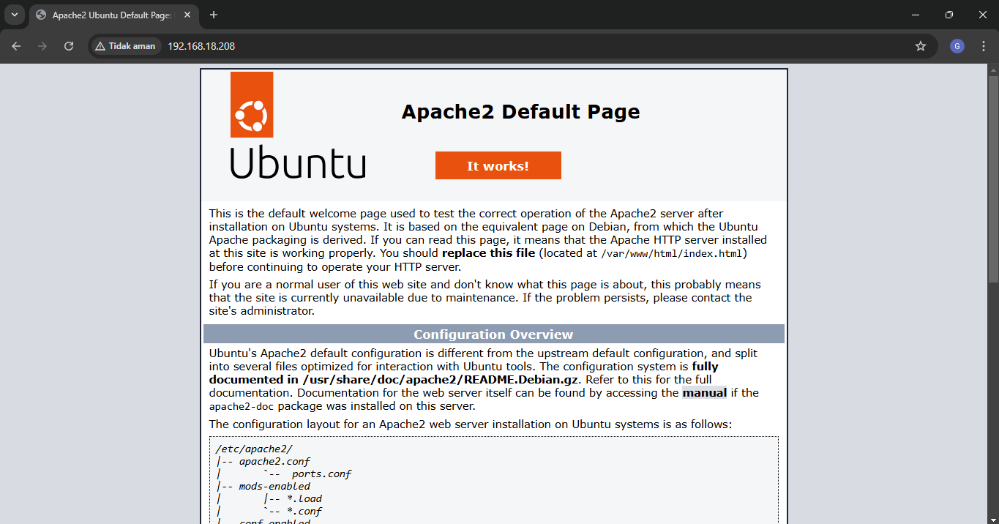
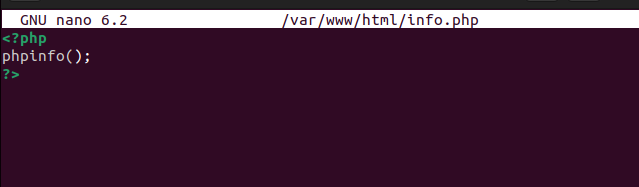
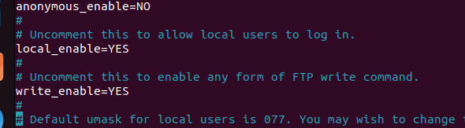

# FINAL PROJECT OS SERVER - 23.83.0957

Membuat Layanan Web Server di **Ubuntu Desktop 22.04.3** dengan spesifikasi berikut:
- **RAM**: 4 GB  
- **Processor**: 4 CPU  
- **Disk**: 40 GB

## Daftar Isi
1. [ Apache](#1-apache)
2. [ Mysql](#2-mysql)
3. [ Php](#3-php)
4. [ SSH server](#4-ssh-server)
5. [ Vsftpd](#5-vsftpd)

---

## 1. Apache 
Penjelasan tentang instalasi dan konfigurasi Apache.
### 1.1 Perbarui Daftar Paket
Langkah 1: Perbarui Daftar Paket
```
sudo apt update
```
### 1.2 Instal Apache2
Langkah 1: Instal Apache2
```
sudo apt install apache2 -y
```
Langkah 2: Cek Status Apache2
```
sudo systemctl status apache2
```

---

## 2. MySQL
### 1.1 Instal MySQL Server
Langkah 1: Install MySQL Server
```
sudo apt install mysql-server -y
```
Langkah 2: Periksa Status MySQL
```
sudo systemctl status mysql
```
Langkah 3: Amankan Instalasi MySQL 
```
sudo mysql_secure_installation
```
Langkah 4: Tes Login ke MySQL
```
sudo mysql

```
isi seperti dibawah 
#### CREATE DATABASE opor_bebek_bu_Kom;
#### CREATE USER 'webuser'@'localhost' IDENTIFIED BY 'password';
#### GRANT ALL PRIVILEGES ON opor_bebek_bu_Kom.* TO 'webuser'@'localhost';
#### FLUSH PRIVILEGES;
---

## 3. Instal PHP
### 1.1 Instal PHP
Langkah 1: Instal PHP
```
sudo apt install php
```
### 1.2 Instal Modul PHP
Langkah 1: Instal Modul PHP
```
sudo apt install libapache2-mod-php php-mysql -y
```
Langkah 2: Restart Apache
```
sudo systemctl restart apache2
```
Langkah 3: Buat file PHP
```
sudo nano /var/www/html/info.php
```

---

## 4. install SSH Server 
Langkah 1: install SSH Server 
```
sudo apt install openssh-server
```
## 5. install vsftpd  
Langkah 1: install vsftpd 
```
sudo apt install vsftpd -y
```
Langkah 2: konfigurasi vsftpd 
```
sudo apt /etc/vsftpd.conf
```
### hapus tanda pagar

---

## 6. File HTML
Langkah 1: Menambahkan file HTML
```
sudo nano /var/www/html/index.html 
```
Langkah 2: Buat index
```
<!DOCTYPE html>
<html lang="id">
<head>
    <meta charset="UTF-8">
    <meta name="viewport" content="width=device-width, initial-scale=1.0">
    <title>Opo Bebek Bu Kom</title>
    <link rel="stylesheet" href="styles.css">
</head>
<body>
    <header class="hero">
        <h1>Opo Bebek Bu Kom</h1>
        <p>Lezatnya bebek goreng khas Bu Kom yang tiada duanya!</p>
    </header>
    <nav class="navbar">
        <ul>
            <li><a href="#tentang">Tentang</a></li>
            <li><a href="#menu">Menu</a></li>
            <li><a href="#kontak">Kontak</a></li>
        </ul>
    </nav>
    <main>
        <section id="tentang" class="section">
            <h2>Tentang Kami</h2>
            <p>Opo Bebek Bu Kom adalah tempat makan favorit untuk menikmati bebek goreng renyah dengan resep keluarga turun-temurun. Kami hanya menggunakan bahan berkualitas untuk memastikan rasa terbaik setiap waktu.</p>
        </section>
        <section id="menu" class="section">
            <h2>Menu Andalan</h2>
            <ul class="menu-list">
                <li>Bebek Goreng Original</li>
                <li>Bebek Goreng Sambal Hijau</li>
                <li>Bebek Bakar Pedas Manis</li>
                <li>Paket Hemat Bebek</li>
            </ul>
        </section>
        <section id="kontak" class="section">
            <h2>Kontak Kami</h2>
            <p>Kunjungi kami di: Jalan Lezat No. 123, Surabaya</p>
            <p>Telepon: 0812-3456-7890</p>
            <p>Email: <a href="mailto:opobebek@bukom.com">opobebek@bukom.com</a></p>
        </section>
    </main>
    <footer class="footer">
        <p>&copy; 2024 Opo Bebek Bu Kom. Semua Hak Dilindungi.</p>
    </footer>
</body>
</html>
```
## 7. File CSS
Langkah 1: Menambahkan file CSS
```
sudo nano /var/www/html/styels.css
```
Langkah 2: buat css
```
body {
    margin: 0;
    font-family: Arial, sans-serif;
    line-height: 1.6;
    color: #333;
}

/* Header */
.hero {
    background: #ffcc00;
    color: #fff;
    text-align: center;
    padding: 50px 20px;
}

.hero h1 {
    margin: 0;
    font-size: 2.5rem;
}

.hero p {
    font-size: 1.2rem;
}

/* Navigasi */
.navbar {
    background: #333;
    color: #fff;
}

.navbar ul {
    list-style: none;
    display: flex;
    justify-content: center;
    padding: 10px 0;
    margin: 0;
}

.navbar ul li {
    margin: 0 15px;
}

.navbar ul li a {
    color: #fff;
    text-decoration: none;
    font-weight: bold;
}

.navbar ul li a:hover {
    color: #ffcc00;
}

/* Section */
.section {
    padding: 40px 20px;
    text-align: center;
}

.section h2 {
    font-size: 2rem;
    margin-bottom: 20px;
}

.menu-list {
    list-style: none;
    padding: 0;
}

.menu-list li {
    font-size: 1.2rem;
    margin: 10px 0;
}

/* Footer */
.footer {
    background: #333;
    color: #fff;
    text-align: center;
    padding: 20px;
    font-size: 0.9rem;
}
```
